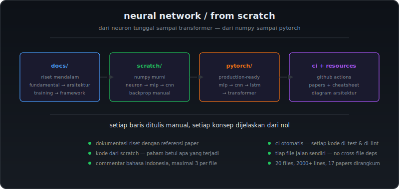
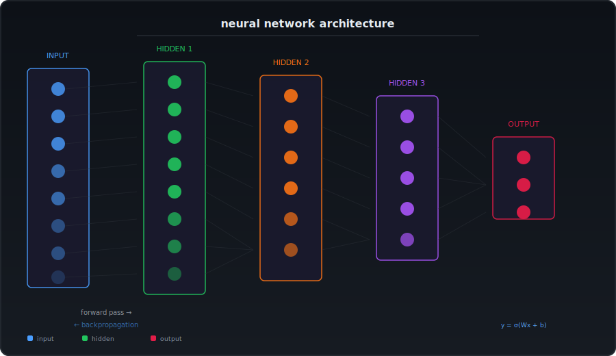

<p align="center">
  
</p>

<p align="center">
  <a href="https://python.org">
    
  </a>
  <a href="https://pytorch.org">
    
  </a>
  <a href="LICENSE">
    
  </a>
  <a href="https://github.com/Vibz-Frachul/neural-network/actions/workflows/ci.yml">
    
  </a>
</p>

---

## tentang repositori

Repositori ini dibuat dengan satu tujuan: **memahami neural network dari fundamental sampai implementasi**. Bukan sekedar copaste kode dari tutorial — setiap baris ditulis manual, setiap konsep dijelaskan dari nol, setiap arsitektur dibedah secara struktural.

Yang membedakan repositori ini dari yang lain:

- **Dokumentasi riset mendalam** — bukan ringkasan superficial. Setiap topik dilacak dari original papers, dijelaskan dengan analogi, dan dikaitkan dengan implementasi. Ada 17 paper dirangkum di `resources/papers.md`.
- **Kode dari scratch** — implementasi numpy murni tanpa framework. Biar paham betul apa yang terjadi di dalam backpropagation, convolution, dan attention mechanism.
- **Kode PyTorch** — versi production-ready dari setiap arsitektur, dengan struktur yang bisa langsung dipakai di project sungguhan.
- **Commentar code Indonesia** — penjelasan dalam Bahasa Indonesia dengan gaya ngobrol, bukan dokumentasi kaku. Maximal 3 commentar per file, sisanya kode bersih.
- **Workflow CI** — setiap kode di-test, di-lint, dan di-type-check otomatis tiap push.

---

## arsitektur

<p align="center">
  
</p>

---

## struktur

```
neural-network/
├── README.md
├── docs/                           ← riset mendalam tiap topik
│   ├── 01-fundamentals.md          ← neuron, activation, loss, forward-backprop
│   ├── 02-architectures.md         ← FNN, CNN, RNN, LSTM, Transformer + comparison
│   ├── 03-training.md              ← optimizer, regularization, hyperparameter
│   └── 04-frameworks.md            ← PyTorch, TensorFlow, JAX comparison
│
├── implementations/
│   ├── python-scratch/             ← numpy murni, tanpa framework
│   │   ├── neuron.py               ← neuron tunggal + gradient descent
│   │   ├── mlp.py                  ← multilayer perceptron backprop
│   │   ├── cnn.py                  ← convolutional layer forward-backward
│   │   └── requirements.txt
│   │
│   └── pytorch/                    ← production-ready dengan PyTorch
│       ├── mlp_mnist.py            ← MLP untuk klasifikasi MNIST
│       ├── cnn_cifar.py            ← CNN untuk CIFAR-10
│       ├── rnn_text.py             ← RNN/LSTM untuk text classification
│       └── transformer.py          ← Transformer encoder dari paper "Attention Is All You Need"
│
├── resources/
│   ├── papers.md                   ← daftar 17 paper penting + rangkuman
│   └── cheatsheet.md               ← formula-formula kunci
│
├── assets/                         ← diagram, ilustrasi
│   ├── hero.svg                    ← banner utama
│   └── architecture.svg            ← diagram arsitektur neural network
│
├── .github/workflows/
│   └── ci.yml                      ← test + lint otomatis
│
├── requirements.txt
└── LICENSE
```

---

## cara menggunakan

```bash
# clone repositori
git clone https://github.com/Vibz-Frachul/neural-network.git
cd neural-network

# install dependencies
pip install -r requirements.txt

# jalankan implementasi scratch (tanpa framework)
python implementations/python-scratch/neuron.py
python implementations/python-scratch/mlp.py
python implementations/python-scratch/cnn.py

# jalankan implementasi pytorch
python implementations/pytorch/mlp_mnist.py
python implementations/pytorch/cnn_cifar.py
```

Tiap file `.py` bisa dijalanin sendiri-sendiri — ngga ada dependency lintas file.

---

## peta belajar

| Urutan | Topik | Dokumen | Kode |
|--------|-------|---------|------|
| 1 | Neuron, activation, loss | `docs/01-fundamentals.md` | `neuron.py` |
| 2 | Forward + backpropagation | `docs/01-fundamentals.md` | `mlp.py` |
| 3 | Arsitektur neural network | `docs/02-architectures.md` | — |
| 4 | Convolutional neural network | `docs/02-architectures.md` | `cnn.py`, `cnn_cifar.py` |
| 5 | Recurrent network + LSTM | `docs/02-architectures.md` | `rnn_text.py` |
| 6 | Transformer + attention | `docs/02-architectures.md` | `transformer.py` |
| 7 | Training & optimizer | `docs/03-training.md` | — |

---

## lisensi

MIT — silakan gunakan, modifikasi, dan distribusikan.
